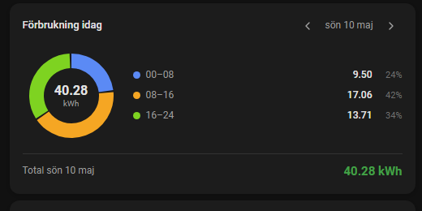

# Electricity Pie Card for Home Assistant

A lightweight, custom Home Assistant card that visualizes your electricity consumption across different times of the day using a sleek pie chart. The card breaks the day down into three logical 8-hour periods: **Night (00:00–08:00)**, **Day (08:00–16:00)**, and **Evening (16:00–24:00)**.

Unlike many other custom cards, this card requires no external dependencies (like ApexCharts). Instead, it renders everything using efficient, native SVG graphics and fetches history data directly through the Home Assistant History API.


---

## Features

- Donut pie chart split into periods: **00–08**, **08–16**, **16–24**
- Fetches data directly from the HA History API (no ApexCharts, no external dependencies)
- Two modes:
  - **Interactive** — date navigation with arrows and a date picker
  - **Static** — locked to a specific day via `offset` (no UI controls shown)
- Live updates for today's card when the sensor value changes
- Correct timezone handling — uses local time in all API calls
- Warning displayed if data is missing due to recorder `purge_keep_days`
- Single-segment pie renders correctly as a full ring
- Configurable colors, title, and max days back
- Registers with `window.customCards` for the HA card picker

---

## Installation

1. Copy `electricity-pie-card.js` to `/config/www/electricity-pie-card.js`

2. Add the resource in `configuration.yaml`:

```yaml
lovelace:
  resources:
    - url: /local/electricity-pie-card.js
      type: module
```

Or via the UI: **Settings → Dashboards → ⋮ → Resources → Add resource**

3. Restart Home Assistant (or reload resources).

---

## Configuration

### Options

| Option | Type | Default | Description |
|---|---|---|---|
| `entity` | string | **required** | The accumulating energy meter sensor |
| `title` | string | `Elförbrukning` | Card title |
| `offset` | integer | *(not set)* | Days relative to today: `0` = today, `-1` = yesterday, `-2` = two days ago. When set, the card is **static** (no date navigation shown) |
| `max_days_back` | integer | `30` | How many days back the date picker allows. Ignored when `offset` is set. See note on recorder below. |
| `colors` | list | `["#5B8AF5","#F5A623","#7ED321"]` | Colors for the three periods |

> **Note on `max_days_back`:** This is limited by Home Assistant's recorder `purge_keep_days` setting (default: **10 days**). If you navigate to a date outside the recorder window, the card will show a warning. To increase history retention, set `purge_keep_days` in your recorder config.

---

### Examples

**Interactive card — today with date navigation:**
```yaml
type: custom:electricity-pie-card
entity: sensor.dsmr_reading_electricity_delivered_1
title: Förbrukning idag
max_days_back: 30
```

**Static card — always shows yesterday:**
```yaml
type: custom:electricity-pie-card
entity: sensor.dsmr_reading_electricity_delivered_1
title: Igår
offset: -1
```

**Static card — two days ago:**
```yaml
type: custom:electricity-pie-card
entity: sensor.dsmr_reading_electricity_delivered_1
title: I förrgår
offset: -2
```

**Interactive with extended history (requires recorder config):**
```yaml
type: custom:electricity-pie-card
entity: sensor.dsmr_reading_electricity_delivered_1
title: Historik
max_days_back: 90
colors:
  - "#E57373"
  - "#FFB74D"
  - "#81C784"
```

---

## How it works

The card calls HA's built-in `/api/history/period/` endpoint directly. It fetches raw state values for the sensor and calculates the consumption diff per 8-hour period locally in JavaScript — the same logic as ApexCharts `group_by: func: diff`, but without any charting library overhead.

All API calls use **local time** (no UTC offset issues). Historical days are cached in memory for the session. Today's data is never cached and re-fetches whenever the sensor state changes.

---

## Recorder configuration (optional)

To extend history beyond the default 10 days, add to `configuration.yaml`:

```yaml
recorder:
  purge_keep_days: 90
```

---

## Changelog

### v1.2
**Performance** — [#2](https://github.com/johro897/electricity-pie-card/issues/2)
- The static `<style>` block is now injected once instead of being reparsed on every render — regular renders now only replace the dynamic content, not the whole shadow DOM
- Live updates (when the sensor's state changes while viewing today) are now debounced by 2 seconds instead of triggering an immediate history fetch on every single tick

### v1.0
- Initial release
- Donut pie chart with three 8-hour periods
- Interactive mode with date picker and arrow navigation
- Static mode via `offset` parameter
- Direct HA History API integration — no ApexCharts dependency
- Configurable colors, title, max days back
- Registers with `window.customCards`
